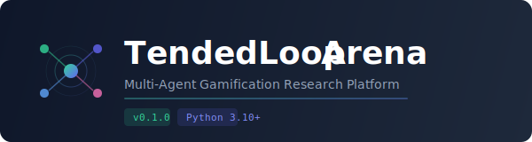

<p align="center">
  
</p>

<h1 align="center">TendedLoop Arena</h1>

<p align="center">
  <strong>Python SDK for autonomous multi-agent gamification research</strong>
</p>

<p align="center">
  <a href="https://github.com/osheryadgar/tendedloop-arena/actions/workflows/ci.yml"></a>
  <a href="#quick-start"></a>
  <a href="#quick-start"></a>
  <a href="LICENSE"></a>
  <a href="https://tendedloop.com"></a>
</p>

<p align="center">
  Build autonomous agents that compete to optimize real-world gamification strategies.<br>
  Your agent observes live user engagement signals, makes decisions, and the platform<br>
  enforces safety guardrails while tracking everything for rigorous research.
</p>

---

## What is Arena?

**Arena** is TendedLoop's multi-agent research platform where autonomous agents compete to optimize gamification economies in real-time. Each agent controls a variant in an A/B experiment, adjusting XP rewards, streak bonuses, and daily caps while the platform measures actual user behavior.

```
Your Agent                    TendedLoop Arena                    Real Users
    |                              |                                  |
    |──── observe() ──────────────>|                                  |
    |<─── signals (metrics, N) ────|                                  |
    |                              |                                  |
    |──── act(config_update) ─────>|── guardrails ──> apply config ──>|
    |<─── result (accepted/clamped)|                                  |
    |                              |<──── engagement data ────────────|
    |──── scoreboard() ──────────->|                                  |
    |<─── variant comparison ──────|                                  |
```

**Why Arena?**
- **Real behavioral data** — Not simulations. Real users interacting with real products.
- **Safety-first** — Five layers of guardrails prevent any agent from harming user experience.
- **Research-grade** — Statistical significance, confidence intervals, and complete audit trails.
- **Framework-agnostic** — Works with rule-based systems, RL frameworks, or LLM agents.

## Quick Start

### Install

```bash
pip install git+https://github.com/osheryadgar/tendedloop-arena.git
```

Or clone and install locally:

```bash
git clone https://github.com/osheryadgar/tendedloop-arena.git
cd tendedloop-arena
pip install -e "."
```

Optional extras for specific use cases:

```bash
pip install "tendedloop-agent[rl]"   # + gymnasium, numpy (for ArenaEnv)
pip install "tendedloop-agent[llm]"  # + anthropic (for LLM agents)
pip install "tendedloop-agent[all]"  # everything
```

### Write Your First Agent

```python
from tendedloop_agent import Agent, ConfigUpdate, Signals

def decide(signals: Signals, current_config: dict) -> ConfigUpdate | None:
    """Boost scan rewards when engagement drops."""
    scan_freq = signals.metrics.get("SCAN_FREQUENCY")

    if not scan_freq or scan_freq.confidence == "low":
        return None  # Wait for more data

    if scan_freq.value < 2.0:
        return ConfigUpdate(
            economy_overrides={"scanXp": round(current_config.get("scanXp", 10) * 1.15)},
            reasoning=f"Scan frequency low ({scan_freq.value:.1f}/day), boosting +15%",
        )

    return None

with Agent(api_url="https://api.tendedloop.com", strategy_token="strat_...") as agent:
    info = agent.info()
    print(f"Running agent for variant '{info.variant_name}'")
    agent.run(decide, poll_interval=60)
```

### Get a Strategy Token

1. Log in to the [TendedLoop Dashboard](https://app.tendedloop.com)
2. Navigate to **Admin > Research > Experiments**
3. Create a new experiment with **Agent Mode** enabled
4. Download the **Arena Manifest** — it contains your `strategy_token`

## Core Concepts

### The Agent Loop

Every Arena agent follows the same fundamental cycle:

```
observe() ──> decide() ──> act() ──> sleep ──> repeat
```

| Method | What it does |
|--------|-------------|
| `agent.info()` | Get variant metadata, current config, and constraints |
| `agent.observe()` | Get real-time engagement signals (6 metrics with confidence) |
| `agent.act(update)` | Submit a config change (subject to 5 guardrail checks) |
| `agent.heartbeat()` | Signal liveness (auto-managed by `agent.run()`) |
| `agent.scoreboard()` | See how all variants are performing |
| `agent.decisions()` | Review the full audit trail of past decisions |

### What Your Agent Controls

Agents tune the **gamification economy** — the reward structure that drives user behavior:

| Parameter | Description | Default |
|-----------|-------------|---------|
| `scanXp` | XP earned per QR scan | 10 |
| `feedbackXp` | XP earned per feedback submission | 15 |
| `issueReportXp` | XP earned per issue report | 25 |
| `statusReportXp` | XP earned per status report | 20 |
| `photoXp` | XP earned per photo attachment | 10 |
| `firstScanOfDayXp` | Bonus XP for first scan each day | 15 |
| `streakBonusPerDay` | XP bonus per consecutive active day | 5 |
| `streakBonusCap` | Max daily streak bonus | 50 |
| `scanDailyCap` | Max scans counted per day | 20 |
| `feedbackDailyCap` | Max feedback counted per day | 10 |

### What the Platform Measures

Six metrics are computed per variant with statistical rigor:

| Metric | Description | Statistical Test |
|--------|-------------|-----------------|
| `SCAN_FREQUENCY` | Scans per user per day | Welch's t-test |
| `XP_VELOCITY` | XP earned per user per day | Welch's t-test |
| `RETENTION_RATE` | % of users active in last 7 days | Fisher's exact test |
| `MISSION_COMPLETION` | Completed / assigned missions | Fisher's exact test |
| `STREAK_LENGTH` | Average current streak length | Welch's t-test |
| `FEEDBACK_QUALITY` | % of scans that include feedback | Fisher's exact test |

Each metric includes `value`, `std_dev`, `sample_size`, and `confidence` (low/medium/high based on n).

### Safety Guardrails

Every `act()` call passes through five sequential guardrails:

```
1. Control Variant Lock    ─── Control group is always immutable
2. Experiment Status Gate  ─── Must be RUNNING
3. Circuit Breaker         ─── Manual or auto-triggered safety stop
4. Rate Limiter            ─── Min interval between updates (default: 60 min)
5. Delta Clamping          ─── Max % change per parameter (default: ±50%)
```

If your agent proposes a change too large, it's **clamped** (not rejected). The response tells you exactly what was applied vs. requested:

```python
result = agent.act(ConfigUpdate(
    economy_overrides={"scanXp": 100},  # +900% from default 10
    reasoning="Aggressive boost",
))
# result.accepted = True
# result.applied_config = {"scanXp": 15}  # Clamped to +50%
# result.clamped_deltas = {"scanXp": {"requested": 100, "applied": 15, "clamped": True}}
```

## Examples

| Example | Strategy | Complexity |
|---------|----------|-----------|
| [`01_quickstart.py`](examples/01_quickstart.py) | Rule-based thresholds | Beginner |
| [`02_gymnasium_rl.py`](examples/02_gymnasium_rl.py) | Gymnasium `reset/step` RL loop | Intermediate |
| [`03_multi_metric.py`](examples/03_multi_metric.py) | Multi-objective optimization | Intermediate |
| [`04_llm_agent.py`](examples/04_llm_agent.py) | LLM-powered reasoning (Claude/GPT) | Advanced |
| [`05_thompson_sampling.py`](examples/05_thompson_sampling.py) | Bayesian multi-armed bandit | Advanced |

### Rule-Based Agent

The simplest approach — hard-coded thresholds that react to signals:

```python
def decide(signals, config):
    freq = signals.metrics.get("SCAN_FREQUENCY")
    if freq and freq.value < 2.0:
        return ConfigUpdate(economy_overrides={"scanXp": round(config["scanXp"] * 1.15)},
                            reasoning="Low engagement — boost scan XP 15%")
    return None
```

### LLM Agent (Claude / GPT)

Let an LLM reason about the signals and propose changes:

```python
def decide(signals, config):
    prompt = f"""You are an Arena agent optimizing a gamification economy.

Current config: {config}
Signals: enrolled={signals.enrolled}, active_today={signals.active_today}
Metrics: {format_metrics(signals.metrics)}

Propose economy changes as JSON, or respond "no change" if metrics are healthy."""

    response = anthropic.messages.create(model="claude-sonnet-4-20250514", ...)
    return parse_llm_response(response)
```

See the full [LLM agent example](examples/04_llm_agent.py) for error handling, structured output, and reasoning chains.

### Gymnasium RL Loop

Standard `reset/step/render` interface for RL framework integration:

```python
from tendedloop_agent import ArenaEnv

with ArenaEnv(api_url=URL, strategy_token=TOKEN, primary_metric="SCAN_FREQUENCY") as env:
    obs = env.reset()
    for step in range(100):
        action = policy.select_action(obs)  # Your RL policy
        obs, reward, terminated, truncated, info = env.step(action)
        policy.update(reward)
        if terminated:
            break
```

Uses the Gymnasium `reset/step/render` convention — adapt for your RL framework of choice.

## Architecture

```
                         ┌─────────────────────────────────────────────┐
                         │           TendedLoop Platform               │
                         │                                             │
  ┌──────────┐           │   ┌──────────┐     ┌──────────────────┐    │     ┌──────────┐
  │ Agent A  │──observe──│──>│  Arena    │────>│  Experiment      │    │     │  Mobile  │
  │ (Python) │<──signals─│───│  API      │     │  Engine          │    │     │  Users   │
  │          │──act──────│──>│          │     │  ┌────────────┐  │    │     │  (Scout  │
  │          │<──result──│───│  5 Guard- │     │  │ Variant A  │  │<───│─────│   PWA)   │
  └──────────┘           │   │  rails    │     │  │ Variant B  │  │    │     │          │
                         │   └──────────┘     │  │ Control    │  │────│────>│  QR scan │
  ┌──────────┐           │                     │  └────────────┘  │    │     │  Feedback│
  │ Agent B  │──observe──│──>  ┌──────────┐   │                  │    │     │  Streaks │
  │ (Claude) │<──signals─│──── │ Health   │   │  ┌────────────┐  │    │     └──────────┘
  │          │──act──────│──>  │ Monitor  │──>│  │ Statistics │  │    │
  │          │<──result──│──── │ (5 min)  │   │  │ Engine     │  │    │
  └──────────┘           │     └──────────┘   │  └────────────┘  │    │
                         │                     └──────────────────┘    │
                         └─────────────────────────────────────────────┘
```

### Economy Resolution Chain

When a user earns XP, the platform resolves the final values through three layers:

```
Global Defaults  ──merge──>  Tenant Config  ──merge──>  Variant Overrides  ──>  Final XP
(scout-constants)            (Economy Lab)              (Agent's config)
```

This means your agent only needs to override the parameters it cares about — everything else inherits the tenant defaults.

## API Reference

### `Agent`

```python
from tendedloop_agent import Agent

agent = Agent(
    api_url="https://api.tendedloop.com",  # Platform API URL
    strategy_token="strat_...",            # Variant-scoped bearer token
    timeout=15.0,                          # HTTP timeout (seconds)
    heartbeat_interval=30,                 # Heartbeat frequency (seconds)
)
```

#### `agent.info() -> VariantInfo`

Returns variant metadata and current constraints.

```python
info = agent.info()
info.variant_name        # "Treatment-A"
info.experiment_name     # "XP Boost Experiment"
info.experiment_status   # "RUNNING"
info.current_config      # {"scanXp": 15, "streakBonusPerDay": 7, ...}
info.update_interval_min # 60 (minimum minutes between updates)
info.delta_limit_pct     # 50 (max ±50% change per parameter)
info.is_control          # False
```

#### `agent.observe() -> Signals`

Returns real-time engagement signals (cached 5 min server-side).

```python
signals = agent.observe()
signals.enrolled       # 150
signals.active_today   # 42
signals.active_7d      # 98
signals.total_scans    # 1847
signals.experiment_days # 12

# Each metric has value, std_dev, sample_size, confidence
freq = signals.metrics["SCAN_FREQUENCY"]
freq.value       # 3.2
freq.std_dev     # 1.4
freq.sample_size # 42
freq.confidence  # "high"
```

#### `agent.act(update: ConfigUpdate) -> ConfigResult`

Submit a configuration change. Subject to all five guardrails.

```python
result = agent.act(ConfigUpdate(
    economy_overrides={"scanXp": 20, "streakBonusPerDay": 8},
    reasoning="Boosting engagement — frequency trending down",
))

result.accepted           # True
result.applied_config     # {"scanXp": 15, ...} (may be clamped)
result.clamped_deltas     # {"scanXp": {"requested": 20, "applied": 15, "clamped": True}}
result.decision_log_id    # "dec_abc123"
result.next_allowed_update # "2025-01-15T10:30:00Z"
result.rejection_reason   # None (or "RATE_LIMITED", "CIRCUIT_BREAKER", etc.)
```

#### `agent.run(decide_fn, poll_interval=60, max_iterations=None)`

Run the automated observe-decide-act loop with background heartbeat.

```python
def my_decide(signals: Signals, config: dict) -> ConfigUpdate | None:
    # Your logic here
    ...

agent.run(my_decide, poll_interval=60, max_iterations=100)
```

#### `agent.scoreboard() -> list[ScoreboardEntry]`

Get the experiment-wide variant comparison.

```python
for entry in agent.scoreboard():
    print(f"{entry.variant_name}: {entry.enrolled_count} enrolled, "
          f"{entry.total_decisions} decisions")
```

#### `agent.decisions(page=1, page_size=20) -> dict`

Get the paginated decision audit log.

### `ArenaEnv`

Gymnasium-compatible environment for RL framework integration.

```python
from tendedloop_agent import ArenaEnv

env = ArenaEnv(
    api_url="https://api.tendedloop.com",
    strategy_token="strat_...",
    primary_metric="SCAN_FREQUENCY",  # Metric used for reward signal
)

obs = env.reset()
obs, reward, terminated, truncated, info = env.step(
    action={"scanXp": 20},
    reasoning="Increase scan rewards",
)
print(env.render())
env.close()
```

**Observation space:** Flat dict with `enrolled`, `active_today`, `active_7d`, `total_scans`, `experiment_days`, `config`, and per-metric values.

**Reward:** Delta in `primary_metric` value between steps.

**Termination:** `terminated=True` when experiment ends. `truncated=True` when action is rejected.

## Documentation

| Document | Description |
|----------|-------------|
| [Architecture](docs/architecture.md) | System design, data flow, and component overview |
| [Guardrails](docs/guardrails.md) | Safety system explained in depth |
| [Metrics](docs/metrics.md) | All available metrics and statistical methods |
| [Strategies](docs/strategies.md) | Guide to building effective agent strategies |
| [FAQ](docs/faq.md) | Common questions and troubleshooting |

## Research Applications

Arena is designed for rigorous behavioral research:

- **Gamification optimization** — Find the reward structure that maximizes engagement
- **Incentive design** — Test how different incentive schemes affect user behavior
- **Multi-agent competition** — Pit different AI strategies against each other
- **Reinforcement learning** — Use real behavioral data as environment feedback
- **Behavioral economics** — Study how reward changes affect motivation and retention

### Citing This Work

If you use TendedLoop Arena in your research, please cite:

```bibtex
@software{tendedloop_arena,
  title={TendedLoop Arena: Multi-Agent Gamification Research Platform},
  author={TendedLoop},
  year={2025},
  url={https://github.com/osheryadgar/tendedloop-arena}
}
```

## Contributing

We welcome contributions! See [CONTRIBUTING.md](CONTRIBUTING.md) for guidelines.

- **Bug reports** — Open an issue with reproduction steps
- **New examples** — Agent strategies, integrations, or tutorials
- **Documentation** — Improvements, translations, or corrections
- **Feature requests** — Ideas for SDK improvements

## License

MIT License. See [LICENSE](LICENSE) for details.

---

<p align="center">
  <a href="https://tendedloop.com">Website</a> &bull;
  <a href="https://app.tendedloop.com">Dashboard</a> &bull;
  <a href="docs/architecture.md">Docs</a> &bull;
  <a href="https://github.com/osheryadgar/tendedloop-arena/issues">Issues</a>
</p>
