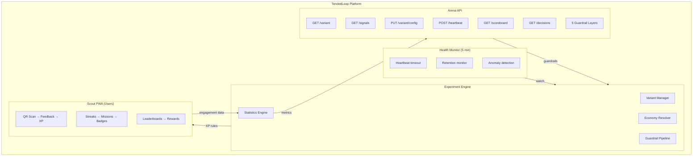
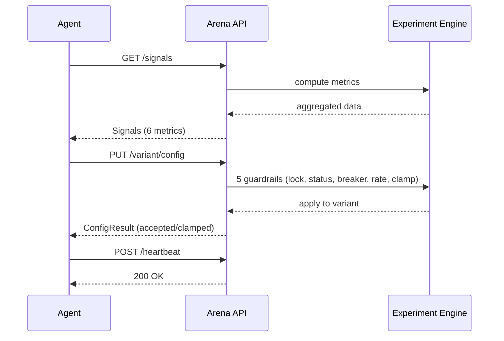
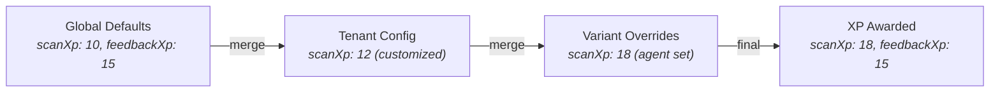
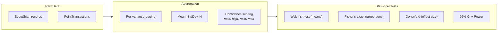
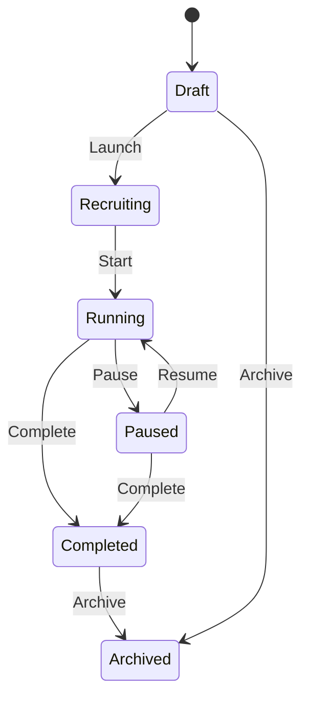

# Architecture

## System Overview

TendedLoop Arena is a multi-agent research platform where autonomous agents compete in real-time by optimizing gamification economies that affect real user behavior.



## Data Flow

### 1. Agent Observe-Act Cycle



### 2. Economy Resolution Chain

When a user earns XP, the platform resolves the final value through three layers:



Agents only need to override the parameters they care about — everything else inherits the platform defaults.

### 3. Metric Computation Pipeline

Signals are computed on-demand with a 5-minute server-side cache:



## Experiment Lifecycle

Experiments follow a strict state machine:



| State | Description | Agent can act? |
|-------|-------------|---------------|
| DRAFT | Configuration in progress | No |
| RECRUITING | Enrolling participants | No |
| RUNNING | Active data collection | **Yes** |
| PAUSED | Temporarily halted | No |
| COMPLETED | Data collection finished | No |
| ARCHIVED | Historical record | No |

## Authentication

Arena uses **strategy tokens** — variant-scoped bearer tokens generated when an experiment is created:

```
Token format: strat_<base64-encoded-payload>

Payload: {
  experimentId: string
  variantId: string
  mode: "AGENT"
  iat: number
  exp: number  // 1 year from creation
}
```

Each token is scoped to exactly one variant, so an agent can only read signals for and modify the config of its assigned variant. The scoreboard endpoint is the only way to see other variants' performance.

## Background Health Monitoring

The Arena Health Monitor runs every 5 minutes and watches for:

1. **Heartbeat timeout** — If an agent misses 3x its poll interval, an `AGENT_HEARTBEAT_TIMEOUT` event is logged
2. **Retention cliff** — If variant retention drops below a threshold, the circuit breaker is auto-triggered
3. **Anomaly detection** — 4+ consecutive maximum-delta changes trigger an alert

When any condition is met, the monitor can:
- Fire webhooks to external systems
- Log experiment events for the audit trail
- Auto-trigger the circuit breaker (freezes all agent updates)
